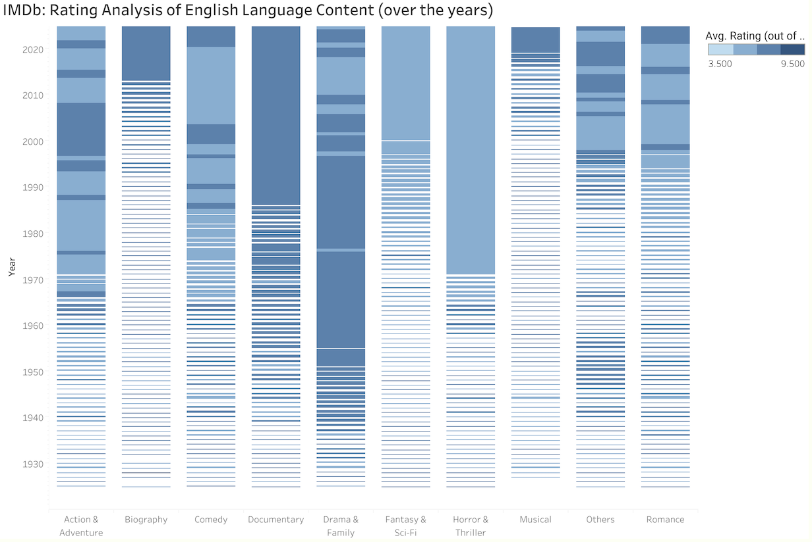

[🔙 Back to my profile](https://shefaliisharma.github.io/)

<!-- TOC -->

<!-- TOC -->

This project contains the analysis of [IMDb Dataset](https://developer.imdb.com/non-commercial-datasets/)

## Objectives: 
1. How have genres and viewer preferences evolved over the years within the content industry for English Language, and how do these trends differ across regions and languages?


## Dataset & Methodology:
The analysis was performed using PostgreSQL queries. The dataset was queried to extract relevant information and answer the research questions. The queries used in the analysis are provided in the results section below.

The output from SQL queries were loaded into Tableau. My local setup for achieving the above consisted of: 

- PostgreSQL server running on localhost on my Mac OS Sonoma
- Datagrip for querying the database and exploratory data analysis
- Tableau for Visualizations

## Analysis:

### Trends within Genres of English Language Content:

I've crafted a query that dissects the ever-changing trends in genres using IMDb's extensive database. By transforming the genre information from a single string into individual elements, I’ve prepared the data to showcase the number of films and average ratings for each genre per year.

**The Process:**
Expand Genres: With a CTE, I convert the list of genres for each title into separate rows using PostgreSQL's UNNEST and STRING_TO_ARRAY functions.
Aggregate Insights: Joining the expanded genres with the IMDb dataset, I focus on English language titles and known regions, filtering out any unknowns.
Calculate Metrics: I compute the total number of titles (title_count) and their average IMDb rating (average_rating) for each genre annually.

```sql
WITH GenreExpansions AS (
    SELECT
        imdb_basic.tconst,
        UNNEST(STRING_TO_ARRAY(genres, ',')) AS genre_split,
        startyear,
        averagerating
    FROM imdb_basic JOIN imdb_ratings ON imdb_basic.tconst = imdb_ratings.tconst
)
SELECT
    genre_split,
    startyear,
    COUNT(tconst) AS title_count,
    AVG(averagerating) AS average_rating
FROM GenreExpansions
JOIN imdb_akas ON imdb_akas.titleid = GenreExpansions.tconst
JOIN imdb_country_codes ON imdb_country_codes.region_code = imdb_akas.region
WHERE language = 'en' AND region_name != 'Unknown'
GROUP BY genre_split, startyear
ORDER BY genre_split, startyear;
```

[](https://public.tableau.com/views/IMDbdatasetGenreTimeSeries/Ratingsanalysisovertheyears?:language=en-US&:sid=&:display_count=n&:origin=viz_share_link)